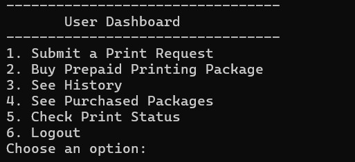
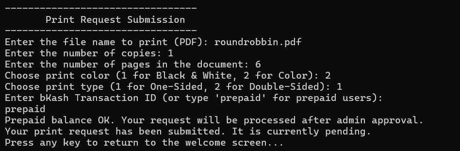
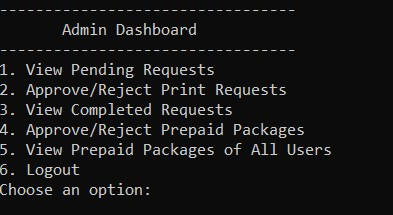

# 🖨️ Printing Management System (PMS)

The **Printing Management System (PMS)** is a terminal-based shell application designed to streamline and automate document printing tasks in academic or office environments. It allows users to submit print requests, manage payments (via bKash or prepaid packages), and track their print job history — all within a simple terminal interface. Admins can approve or reject requests, validate transactions, and monitor user activity.

---

## 📌 Features

### 👤 User Functions:
- **User Registration/Login**
- **Submit Print Requests** (choose copies, color, type)
- **Pay via bKash** or **use Prepaid Packages**
- **Buy Prepaid Packages** (e.g., 100 pages)
- **View Print History**
- **Check Request Status**
- **Logout**

### 🛠️ Admin Functions:
- **Admin Registration/Login**
- **View & Approve/Reject Print Requests**
- **Verify bKash Payments**
- **Approve/Reject Prepaid Packages**
- **View Completed Jobs**
- **Monitor Prepaid Balances**
- **Logout**

---

## 🖥️ System Requirements

- A terminal-based **Linux environment** (e.g., Ubuntu, WSL)
- Pre-installed **Shell scripts** with execution permissions

---

## 🎯 Learning Objectives

This project demonstrates:
- File-based data management using `.txt` files (e.g., `prepaid.txt`, `history.txt`)
- Scripting with `awk`, `grep`, `sed`, and redirection
- Automating conditional workflows (`if`, `case`, `while`)
- Modularized functions for reusability (e.g., `approve_request`)
- Safe file updates using temporary file techniques

---

## 📁 Files Used

- `prepaid.txt`: Tracks prepaid packages
- `history.txt`: Maintains print request history
- `users.txt`, `admin.txt`: Stores user and admin credentials
- Shell scripts for each user/admin function

---

## 🖼️ System Preview

> Sample screenshots show:

### 👤 User Registration
  

### 🏠 User Dashboard

### 🧾 Print Submission (Prepaid)

### 💳 Print Submission (bKash)

### 🧑‍💼 Admin Approval Dashboard

### 📚 Print History & Status Tracking

---

## ✅ Benefits

- Reduces manual tracking of print requests
- Ensures secure and transparent payment verification
- Enhances accountability and efficiency in printing workflows
- Ideal for **university labs**, **libraries**, and **institutional centers**

---

## 🔐 Role-Based Access

- **Users** can only access their own requests and balances
- **Admins** have full control over request approvals, transaction verification, and system oversight

---

## 📌 Conclusion

This project gave us practical experience in:
- Building a shell-based management system
- Handling multi-user roles and payment validation
- Automating common service tasks through scripting

The PMS showcases the power of shell scripting for real-world task automation and serves as a lightweight yet robust system for managing print services in high-demand environments.

---

## 📣 Credits

Developed as part of an academic project for learning **System Automation**, **Shell Scripting**, and **Service Management Workflows**.

